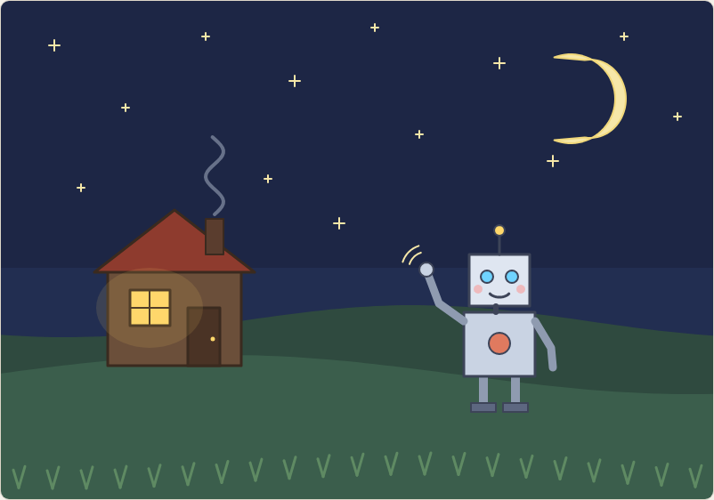
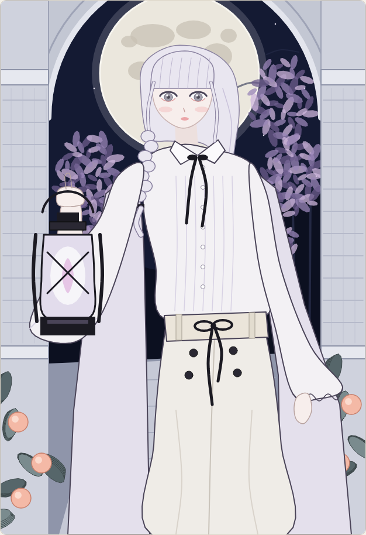

# お絵かきキャンバス

ブラウザで動く、ビルド不要のシンプルなお絵かきアプリです。`index.html` をブラウザで開くだけで使えます。

- ペン（色・太さ）、消しゴム、元に戻す、全消去、PNG保存
- **AIが描く**：Claude が一筆ずつ設計した絵を、人間と同じペンで描いていきます
  - 描く絵はツールバーのメニューで選べます
  - URL に `?ai=<id>` を付けると開いた直後にアニメーションで描画、`&instant` も付けると一瞬で描画します（例：`?ai=moonlight-copy&instant`）

## AIの作品「眠らない同僚」

夜の丘の上で、明かりの灯る家に向かって手を振る小さなロボット。

## 模写「月下のランタン」（`moonlight-copy`）

ユーザーから受け取った参考画像（月夜のアーチの下でランタンを掲げる人物）を、目で見て測りながら一筆ずつ写し取った練習作です。細部は省き、フラットな塗りで描いています。

## ファイル構成

- `draw-kit.js`：楕円・曲線（Catmull-Rom）などの共通の図形ヘルパー
- `ai-drawing.js`、`moonlight-copy.js`：それぞれの絵のデータ。すべて `{color, width, fill, points}` のストロークの並びです
